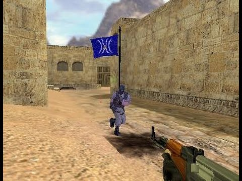
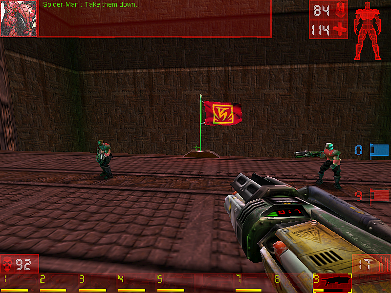

# O que é CFT?
**(C)apture (T)he (F)lag**: Capture a bandeira.
## De onde veio?
Um jogo **presencial** em que se joga em times.

## Regras
- Os jogadores são divididos em dois times
- Cada time tem uma bandeira
- Cada time possui um território
- Os times utilizam podem se defender ao estilo "pega-pega"

## Objetivo
- Entrar no território inimigo
- Trazer a bendeira para o seu território sem ser pego

---

# CTFs em jogos eletrônicos
## CS 1.6

Fonte: https://www.youtube.com/watch?v=CRSDfefijVw

---

# CTFs em jogos eletrônicos
## Unreal Tournament

Fonte: https://unrealarchive.org/maps/unreal-tournament/capture-the-flag/U/ctf-utdmw-hallofgiants_c6b36e7c.html

---

# E a segurança da informação? Onde entra?

## Defcon
- Conferência hacker em vegas
- De 1996 até hoje
- Difusão (pesquise ctfSites)

## O princípio é o mesmo:
- Acessar um sistema inseguro
- Encontrar uma chave (flag)
- Validar para mostrar que entrou

---

# Vantagens

- Mão na massa
- Aprender novas técnicas
- Desenvolver raciocínio lógico

---

# picoCTF
- Carnegie Mellon University
- Em inglês
- Dificuldade progressiva

---
# Referências

## Slides na descrição
https://github.com

## História
[1] - https://en.wikipedia.org/wiki/Capture_the_flag 

[2] - https://www.defcon.org/html/links/dc-ctf-history.html
